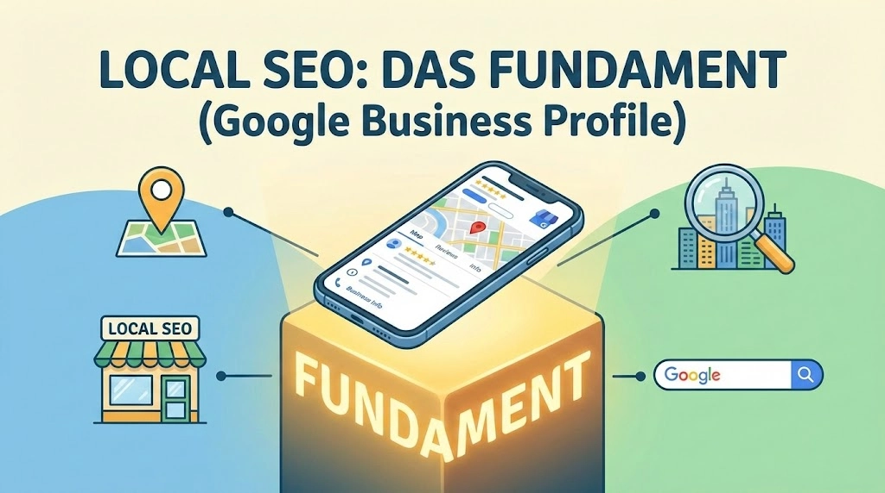

Fahrschulen haben 2026 ein Problem: Wer nicht im "Local Pack" (der Karte ganz oben bei Google) oder in den AI-Overviews auftaucht, existiert digital quasi nicht.

Die Zeiten, in denen "Fahrschule [Stadt]" als Keyword reichte, sind vorbei. Heute entscheidet Google anhand von Trust, Aktualität und Nutzerverhalten, wer die neuen Fahrschüler bekommt.

Dieser Guide ist der aktuelle Standard für 2026. Kein Bla-Bla, nur die Hebel, die für Anmeldungen sorgen.

## **1. Local SEO: Das Fundament (Google Business Profile)**

Für 90% der Fahrschulen ist das Google Unternehmensprofil wichtiger als die eigentliche Website. Hier entscheidet sich das Spiel.

**Vollständigkeit:** Jedes Feld muss ausgefüllt sein. Attribute wie "LGBTQ+ freundlich" oder "Barrierefreier Zugang" sind 2026 Rankingfaktoren.

**Reale Fotos:** Keine Stockfotos von lachenden Menschen im Auto. Google erkennt das. Lade Fotos vom echten Fuhrpark, dem Eingangsbereich und dem Theorie-Raum hoch.

**Q&A Sektion:** Warte nicht auf Fragen. Stelle und beantworte die häufigsten Fragen (Kosten, Dauer, Anmeldung) selbst über den Unternehmens-Account. Das füttert die Google AI.

**Bewertungs-Management:** Antworten Sie auf jede Bewertung. Nicht nur "Danke". Nutzen Sie Keywords in der Antwort: "Danke für dein Lob zu unserer Intensiv-Ausbildung in München..."

## **2. Die Website: Mobile First & Speed**

Fahrschüler sind Gen Z und Alpha. Wenn die Seite auf dem iPhone länger als 1,5 Sekunden lädt oder nicht intuitiv ist, sind sie weg.

**Sticky "Anrufen" Button:** Ein Button, der am unteren Bildschirmrand "klebt", egal wie weit man scrollt.

**Preistransparenz:** 2026 ist das Verstecken von Preisen ein negatives Nutzersignal (hohe Absprungrate). Zeige zumindest Beispielrechnungen ("Was kostet der Führerschein Klasse B wirklich?").

**Online-Anmeldung:** Ein PDF zum Ausdrucken reicht nicht. Ein digitales Formular (Typeform o.ä.) ist Pflicht für die Conversion-Rate.

## **3. Content 2026: E-E-A-T und Video**

Google bewertet Inhalte nach E-E-A-T (Experience, Expertise, Authoritativeness, Trust).

**Fahrlehrer-Profile:** Zeigen Sie die Menschen. Wer bildet aus? Wie lange schon? Das schafft "Experience"-Punkte.

**Lokale Landingpages:** Wenn Sie Fahrschüler aus Vororten abholen, brauchen Sie für jeden Ort eine Seite (z.B. "Fahrschule abholen [Vorort]").

**Video-Content:** Binden Sie TikToks oder Reels (z.B. "Einparken in 3 Schritten") auf der Website ein. Das erhöht die Verweildauer massiv – ein Top-Rankingfaktor.

**FAQ für Voice Search:** Fragen wie "Wie lange dauert der Führerschein in [Stadt]?" müssen wörtlich auf der Seite stehen und direkt beantwortet werden.

## **4. Technisches SEO: Strukturierte Daten**

Damit die Google AI versteht, wer Sie sind, müssen wir "Schema Markup" nutzen. Das ist Code, der im Hintergrund läuft.

**LocalBusiness Schema:** Definieren Sie Öffnungszeiten, Preise und Standort maschinenlesbar.

**Product Schema:** Ausbildungen (Klasse B, A, BE) können als "Produkt" ausgezeichnet werden, um Preise direkt in der Suche anzuzeigen.

## **Die Checkliste & Template (Zum Kopieren)**

Hier ist das operative Template für Ihre Marketing-Assistenz oder Agentur.

### **A. Sofort-Maßnahmen (Einmalig)**

- [ ] Google Business Profil: Alle "Attribute" aktualisiert?
- [ ] Fotos: Mindestens 5 aktuelle Fotos vom Team/Fuhrpark hochgeladen (mit Geotagging).
- [ ] Schema Markup: LocalBusiness und Course Schema auf der Website implementiert?
- [ ] Page Speed: Mobile Score über 80/100 (Google PageSpeed Insights)?
- [ ] Broken Links: Alle 404-Fehler behoben?

### **B. Monatliche Routine (Recurring)**

- [ ] 4 neue Google Beiträge (Google Posts): Updates zu Kursstart, freien Plätzen oder neuen Autos.
- [ ] 1 neuer Blogartikel/Video: Fokus auf eine spezifische Frage (z.B. "Angst vor der Autobahnfahrt?").
- [ ] Backlinks prüfen: Erwähnung im lokalen Stadtportal oder bei Sportvereinen (Sponsoring) prüfen.
- [ ] Bewertungen: Auf alle neuen Reviews reagiert?

### **C. Content-Planung (Beispiele für 2026)**

**Kosten-Breakdown:** "Warum der Führerschein 2026 teurer ist – eine ehrliche Rechnung."

**Technik:** "E-Auto Fahrschule: Warum du auf Automatik lernen solltest (B197)."

**Lokales:** "Die schwierigsten Kreuzungen in [Stadt] – und wie du sie meisterst."

## **Fazit**

SEO für Fahrschulen ist 2026 kein Hexenwerk, aber Fleißarbeit. Wer Vertrauen aufbaut (E-E-A-T) und technisch sauber liefert, gewinnt den Markt. Starten Sie mit dem Google Business Profil – heute noch.

*Lust auf mehr Praxis-Guides für lokale Unternehmen? Abonniere den Feed.*
